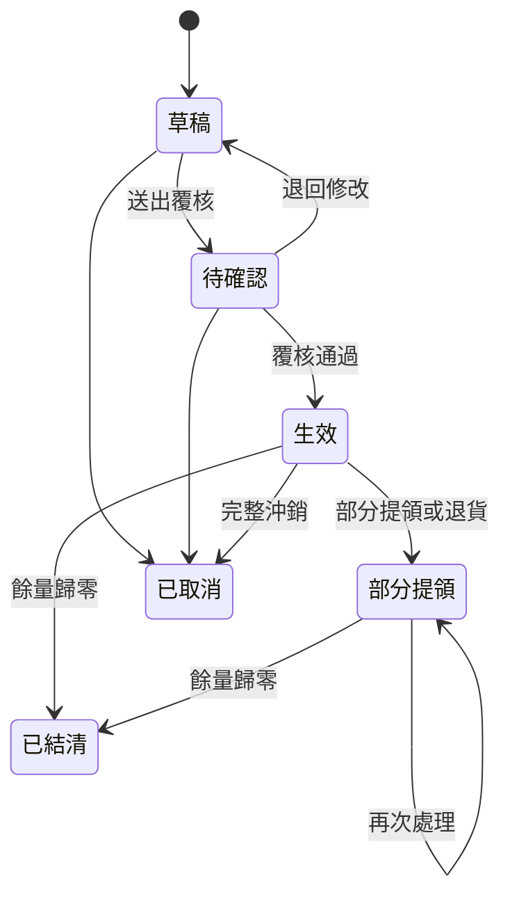
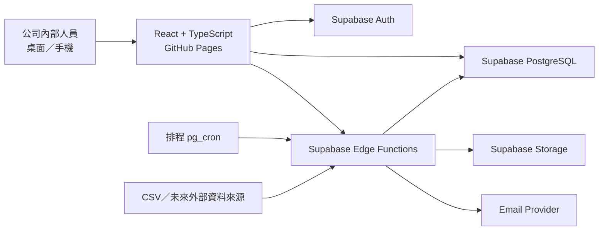

# InventoryHub 寄庫管理系統

InventoryHub 是公司內部使用的寄庫管理平台，用來追蹤「客戶已購買、但尚未提領，仍存放在公司倉庫」的商品。

系統以訂單為來源，記錄寄庫、分次提領、未提領商品退貨、數量調整、覆核與完整稽核軌跡，讓使用者可以清楚回答：

- 哪位客戶目前寄放哪些商品？
- 每項商品位於哪個倉庫、剩餘多少？
- 寄庫量來自哪張訂單及哪張寄庫單？
- 是誰建立、覆核或執行異動？
- 訂單、寄庫、提領與退貨數量是否平衡？
- 哪些寄庫即將到期，或存在帳實不符？

> 目前版本為第一階段基礎建設。登入介面、響應式儀表板、Supabase 連線基礎、角色權限、稽核資料表與 GitHub Pages 部署流程已完成；正式寄庫、提領與退貨交易會在後續階段實作。

## 主要功能

### 寄庫管理

- 一張寄庫單對應一張訂單。
- 一張訂單可建立多張寄庫單。
- 一張寄庫單可包含多項商品。
- 每項商品可指定寄放倉庫及寄庫期限。
- 支援草稿、待確認、生效、部分提領、已結清及已取消狀態。
- 建立人不得覆核自己的單據。
- 生效後不直接覆寫原始資料，錯誤以調整或沖銷處理。

### 客戶寄庫查詢

- 按客戶查詢目前寄庫商品與剩餘量。
- 按商品、訂單、寄庫單及倉庫展開明細。
- 顯示寄庫期限、建立資訊與最近異動。
- 查詢歷次提領、退貨、調整及沖銷紀錄。

### 分次提領與 FIFO

- 客戶可以分多次提領。
- 一次可只提領部分商品或部分數量。
- 操作人員必須先選擇提貨倉庫。
- 系統在同一客戶、商品與倉庫範圍內，依寄庫生效時間採先進先出（FIFO）。
- 系統保存每次提領實際扣到的寄庫單明細。
- 已提領的商品不能重新放回寄庫。

### 未提領商品退貨

- 只能退回尚未提領的寄庫餘量。
- 依 FIFO 追溯退貨來源寄庫明細。
- 依商品折扣後淨額計算平均成交單價。
- 保存建議退貨金額、核准金額、修改原因及覆核資訊。
- 退貨只減少客戶寄庫量；公司可售庫存由外部庫存系統管理。

### 權限與稽核

- 角色包含查詢人員、寄庫人員、倉庫人員、覆核主管、稽核人員及系統管理員。
- 支援角色權限及個別人員 allow／deny 覆寫。
- 離職或停用人員的歷史姓名及員工編號永久保留。
- 每次異動保存執行人、時間、原因、異動前後內容及 Request ID。
- 稽核紀錄採 append-only 設計，一般使用者不能修改或刪除。

### 異常與通知

- 客戶寄庫餘量低於可設定門檻。
- 寄庫帳面量高於匯入的倉庫實際庫存快照。
- 訂單、直接交付、寄庫、提領及退貨數量不平衡。
- 寄庫即將到期或已逾期。
- 第一版提供系統內通知與 Email provider 介面。

### 匯入、匯出與報表

- 第一版規劃支援客戶、商品、訂單、倉庫、人員及庫存快照 CSV 匯入。
- 提供每日及每月寄庫結存表。
- 支援 Excel／CSV 匯出及寄庫單、提貨單、退貨單 PDF。
- 後續可增加 Google Sheets、外部 SQL、ERP 或 API adapter。

## 操作流程

### 建立寄庫單


系統會檢查累計寄庫量不得超過：

```text
可寄庫量 = 訂購量 - 直接交付量 - 已建立寄庫量
```

找不到正式訂單時可以人工建立，但必須：

- 使用 `MANUAL-日期-流水號`。
- 填寫人工建立原因。
- 經過另一位人員覆核。
- 永久保留人工來源標記。

### 客戶提領


### 寄庫退貨


商品平均成交單價計算方式：

```text
平均成交單價
=（商品原始金額 - 商品折扣 - 分攤訂單折扣）÷ 訂購數量
```

運費與稅額不列入商品退貨成本。

## 狀態流程



## 系統架構



### 技術組成

| 項目 | 技術 |
|---|---|
| 前端 | React 19、TypeScript、Vite |
| 靜態部署 | GitHub Pages |
| 登入 | Supabase Auth |
| 資料庫 | Supabase PostgreSQL |
| 資料權限 | PostgreSQL Row Level Security |
| 後端交易 | PostgreSQL Functions／Supabase Edge Functions |
| 排程 | Supabase `pg_cron` |
| 附件 | Supabase Storage |
| CI/CD | GitHub Actions |

GitHub Pages 只存放靜態前端。客戶、訂單、寄庫與稽核資料不會存放在 GitHub。

## 目前畫面使用方式

### 尚未連接 Supabase

1. 啟動本機開發環境。
2. 開啟登入頁。
3. 點選「進入開發預覽」。
4. 檢視響應式儀表板、最近寄庫單及功能模組入口。

開發預覽模式只用於檢視介面，不會保存或修改正式資料。

### 已連接 Supabase

1. 由管理員在 Supabase Auth 建立或邀請公司人員。
2. 管理員為人員填寫員工編號及指派角色。
3. 使用者以公司 Email 與密碼登入。
4. 系統依角色與個別權限顯示可用功能。

## 本機開發

### 環境需求

- Node.js 22 或以上
- pnpm 11

### 安裝與啟動

```bash
pnpm install
cp .env.example .env.local
pnpm dev
```

預設開發網址由 Vite 顯示於終端機。

### 品質檢查

```bash
pnpm lint
pnpm build
```

## Supabase 設定

1. 建立一個 Supabase project。
2. 在 SQL Editor 執行：

   ```text
   supabase/migrations/202607180001_phase1_foundation.sql
   ```

3. 複製 Project URL 與 publishable key。
4. 建立 `.env.local`：

   ```dotenv
   VITE_SUPABASE_URL=https://your-project.supabase.co
   VITE_SUPABASE_PUBLISHABLE_KEY=sb_publishable_your_key
   ```

5. 建立第一位使用者後，在 SQL Editor 指派管理員角色：

   ```sql
   insert into public.user_roles (user_id, role_id)
   select p.id, r.id
   from public.profiles p
   cross join public.roles r
   where p.email = 'admin@company.com'
     and r.code = 'admin';
   ```

> 不得將 service role key、資料庫密碼或其他管理密鑰放入前端、GitHub repository 或 GitHub Pages。

## GitHub Pages 部署

1. 進入 GitHub repository 的 **Settings → Pages**。
2. 將 Source 設為 **GitHub Actions**。
3. 在 **Settings → Secrets and variables → Actions** 新增：
   - `VITE_SUPABASE_URL`
   - `VITE_SUPABASE_PUBLISHABLE_KEY`
4. 推送至 `main` 後，`.github/workflows/deploy-pages.yml` 會自動建置並部署 `dist`。

## 專案結構

```text
InventoryHub/
├─ app/
│  ├─ page.tsx                 # 登入頁、儀表板與模組入口
│  ├─ globals.css              # 桌面與手機響應式樣式
│  └─ supabase.ts              # Supabase client 設定
├─ src/
│  └─ main.tsx                 # React 進入點
├─ supabase/
│  └─ migrations/              # PostgreSQL schema、RLS 與初始權限
├─ public/                     # 靜態資源
├─ .github/workflows/
│  └─ deploy-pages.yml         # GitHub Pages 部署流程
├─ .env.example
├─ index.html
├─ package.json
└─ vite.config.ts
```

## 開發里程碑

- [x] 第一階段：專案基礎、登入介面、響應式導覽、角色權限、稽核 schema 與 RLS
- [ ] 第二階段：客戶、商品、訂單、倉庫、人員與 CSV 匯入
- [ ] 第三階段：寄庫單、覆核、異動帳本與餘量查詢
- [ ] 第四階段：FIFO 提領、退貨、調整與沖銷
- [ ] 第五階段：報表、庫存快照比對、異常與通知
- [ ] 第六階段：PDF、簽收附件、操作文件與正式部署

## 安全原則

- 所有正式資料表必須啟用 Row Level Security。
- 權限判斷不得只依賴前端顯示或隱藏按鈕。
- 關鍵數量異動必須在單一資料庫交易內執行。
- 生效交易不得直接刪除或覆寫。
- 敏感金鑰只能存放於 Supabase 或 GitHub Actions secrets。
- 正式環境與開發／測試環境必須分離。

## License

目前尚未指定開源授權。Repository 雖為 Public，在正式加入授權文件前，請勿假設程式碼可自由再散布或商用。
