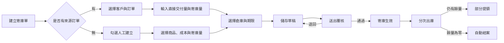
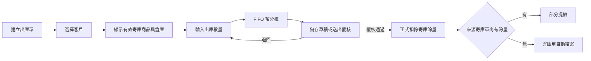
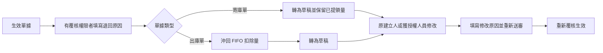
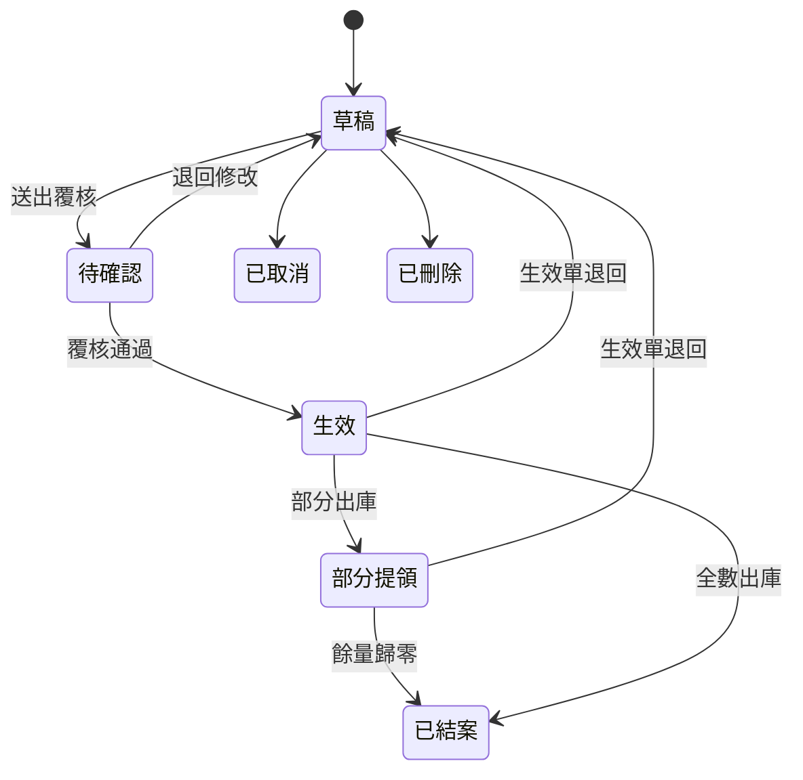
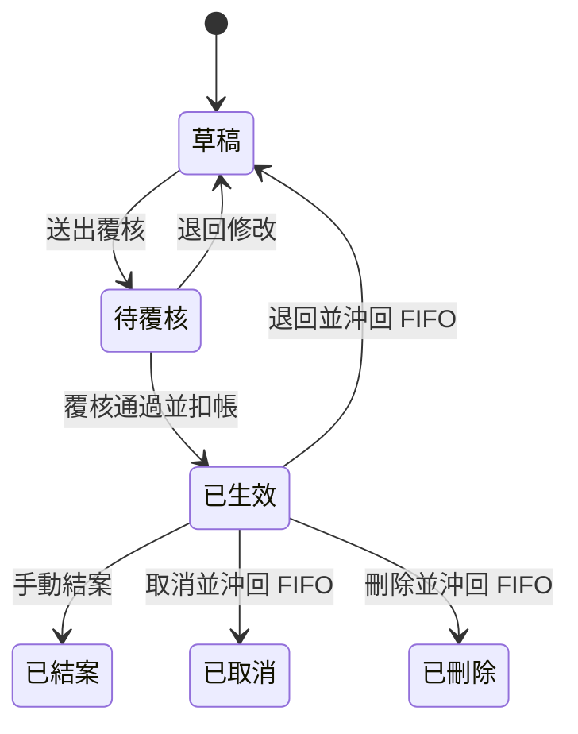
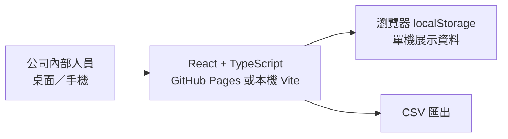
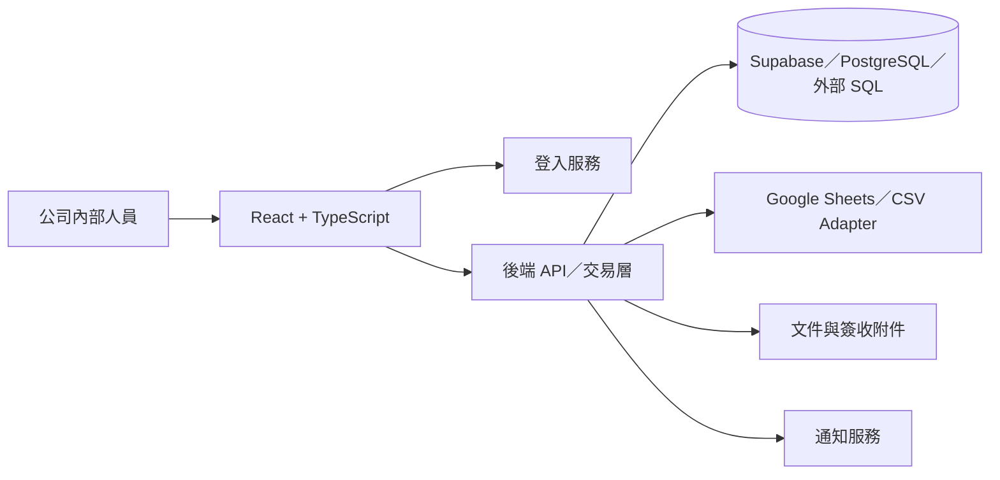

# InventoryHub 寄庫管理系統

InventoryHub 是供公司內部使用的網頁寄庫管理系統，用來追蹤「商品已售予客戶，但尚未全部交付，仍寄放於公司倉庫」的數量與後續提領。

目前版本是可操作的前端 MVP，可建立寄庫單及出庫單、執行覆核、依 FIFO 扣除寄庫量、查詢客戶餘量、管理人員權限、保留異動歷程，以及依日期區間匯出 CSV。

> 目前資料儲存在瀏覽器 `localStorage`，適合流程展示與需求驗證，不適合作為多人共用的正式資料庫。正式上線時可改接 Supabase／PostgreSQL、外部 SQL、Google Sheets、CSV 或其他 API；GitHub Pages 只負責提供靜態網頁。

## 系統功能

### 寄庫單

- 一張寄庫單對應一張訂單；同一訂單可建立多張寄庫單。
- 每張寄庫單可包含多項商品，並為每項商品選擇寄放倉庫。
- 建立時可同時輸入「本次直接交付量」及「本次寄庫量」。
- 系統依訂購量、過去直接交付量及過去寄庫量計算尚可分配量。
- 找不到來源訂單時，可勾選「人工建立寄庫單」，並永久保留人工來源標記。
- 可設定寄庫期限及備註。
- 寄庫餘量全部出庫後，系統自動將寄庫單轉為「已結案」。

訂單寄庫的數量檢核如下：

```text
尚可分配量 = 訂購量 - 過去直接交付量 - 過去寄庫量

本次直接交付量 + 本次寄庫量 <= 尚可分配量
```

### 出庫單與 FIFO

- 依客戶顯示目前仍有效的寄庫商品及倉庫餘量。
- 可選擇一項或多項商品並輸入本次出庫量。
- 在同一客戶、商品及倉庫範圍內，依最早寄庫批次自動執行 FIFO 分攤。
- 草稿及待覆核階段只保留預分攤；覆核生效後才正式扣除寄庫餘量。
- 出庫明細保留實際扣到的寄庫單、數量及平均成本。
- 可記錄預計／實際取貨日期、取貨人、電話、車號及備註。
- 支援列印出庫單。

### 客戶寄庫餘量

- 按客戶、商品及倉庫查詢目前可出庫數量。
- 可追溯來源訂單、寄庫單及寄庫期限。
- 只計入「生效」及「部分提領」的寄庫單。
- 本系統目前只管理客戶寄庫帳面量，不管理公司的可售實體庫存。

### 修改與異動歷程

- 每位人員都可以修改自己建立的草稿或退回修改單據。
- 修改別人建立的寄庫單或出庫單，需要對應的「修改他人單據」權限。
- 待覆核單據必須先退回，才能修改。
- 有覆核權限者可將生效單據退回修改。
- 每次修改必須填寫修改原因。
- 歷程保留動作、修改原因、修改前後內容、執行人、員工編號及時間。
- 他人修改單據不會改變原建立人。
- 已發生提領的寄庫單，其寄庫量不得修改至低於累計已提領量。

### 取消、刪除與結案

- 「取消」與「刪除」都不會移除資料，只會變更單據狀態，供後續稽核。
- 寄庫單不提供手動結案；所有商品寄庫餘量為零時自動結案。
- 出庫單可依業務需要手動結案。
- 已生效出庫單若取消或刪除，系統會沖回其 FIFO 扣除量。
- 已生效出庫單若退回修改，也會先恢復寄庫餘量；重新送審並覆核時，再依當時餘量重算 FIFO。

### 查詢與 CSV 匯出

- 寄庫單及出庫單皆可依開始日期、結束日期、狀態及客戶篩選。
- 可將指定區間的單據匯出為 UTF-8 CSV。
- 寄庫單 CSV 包含訂單、客戶、商品、直接交付量、寄庫量、餘量、成本、倉庫、建立人及覆核人等欄位。
- 出庫單 CSV 包含客戶、商品、出庫量、FIFO 來源寄庫單、分攤量、成本、取貨資訊、建立人及覆核人等欄位。

## 操作流程

### 寄庫流程



### 出庫流程



### 生效單退回修改



## 單據狀態

### 寄庫單



### 出庫單



## 權限說明

系統目前提供「寄庫人員」、「覆核主管」及「系統管理員」三種角色。角色會帶入一組預設權限，管理者仍可在人員編輯畫面逐項授予或撤銷。

| 權限 | 用途 |
|---|---|
| 建立寄庫單 | 建立及送出自己的寄庫單 |
| 修改他人寄庫單 | 修改其他人建立、且處於草稿／退回狀態的寄庫單 |
| 覆核寄庫單 | 覆核、退回待確認寄庫單，以及將生效寄庫單退回修改 |
| 建立出庫單 | 建立及送出自己的出庫單 |
| 修改他人出庫單 | 修改其他人建立、且處於草稿／退回狀態的出庫單 |
| 覆核出庫單 | 覆核、退回待覆核出庫單，以及將生效出庫單退回修改 |
| 覆核自己的單據 | 允許在同時具有對應覆核權限時覆核自己建立的單據 |
| 取消沖銷出庫單 | 取消或刪除已生效出庫單並恢復寄庫量 |
| 列印出庫單 | 列印出庫文件 |
| 管理人員權限 | 查看、新增、調整及停用人員帳號與個別權限 |

重要規則：

- 修改自己的單據不需要「修改他人單據」權限。
- 一般覆核權限預設只能覆核他人建立的單據。
- 「覆核自己的單據」不能單獨使用，必須同時具有寄庫或出庫覆核權限。
- 停用帳號不會刪除歷史人員名稱、員工編號或異動紀錄。

### 預設角色權限

| 角色 | 預設能力 |
|---|---|
| 寄庫人員 | 建立寄庫單、建立出庫單、列印出庫單；可修改自己建立的草稿／退回單據 |
| 覆核主管 | 寄庫與出庫的建立、修改他人單據、覆核及列印；預設不能覆核自己的單據 |
| 系統管理員 | 所有功能，包含覆核自己的單據、取消沖銷及人員權限管理 |

## 如何使用

### 1. 進入系統

1. 開啟本機預覽或 GitHub Pages 網址。
2. 在登入展示頁點選「進入寄庫管理系統」。
3. MVP 右上角可切換王小明、林主管或陳管理員，以測試不同角色。

### 2. 建立寄庫單

1. 點選「＋ 建立寄庫單」。
2. 有訂單時選擇客戶及訂單；無訂單時勾選最上方「人工建立寄庫單」。
3. 選擇商品，填寫本次直接交付量、本次寄庫量、倉庫及寄庫期限。
4. 選擇「儲存草稿」或「送出覆核」。
5. 覆核人員至「待辦與覆核」執行退回或覆核生效。

### 3. 建立出庫單

1. 點選「＋ 建立出庫單」。
2. 選擇客戶，系統會列出該客戶有效的寄庫商品及倉庫餘量。
3. 輸入本次出庫量與取貨資訊。
4. 儲存草稿或送出覆核。
5. 覆核通過後，系統正式扣除寄庫量並更新來源寄庫單狀態。

### 4. 修改單據

1. 在寄庫單或出庫單清單點選單號。
2. 草稿／退回單據若符合權限，會顯示「修改單據」。
3. 生效單據必須先由有覆核權限者點選「退回修改」並填寫原因。
4. 修改內容並填寫必填的修改原因，再儲存或重新送出覆核。
5. 可在單據下方「異動時間軸」查看完整紀錄。

### 5. 管理人員與權限

1. 以具有「管理人員權限」的帳號進入「人員與權限」。
2. 可新增人員，或在既有人員右側點選「調整」。
3. 設定姓名、員工編號、Email、角色及帳號狀態。
4. 在「個別權限」逐項勾選需要授予的操作能力後儲存。

### 6. 匯出 CSV

1. 進入「寄庫單管理」或「出庫單管理」。
2. 選擇開始日期、結束日期、狀態及客戶。
3. 點選「匯出 CSV」。

## 示範資料

| 單號 | 用途 |
|---|---|
| `CS-TEST-RETURNED` | 驗證退回寄庫單可修改及修改歷程 |
| `OUT-TEST-RETURNED` | 驗證退回出庫單可修改及 FIFO 預分攤 |
| `CS-TEST-AUTO-CLOSE` | 搭配下列出庫單驗證餘量歸零自動結案 |
| `OUT-TEST-AUTO-CLOSE` | 覆核後扣除 20 件並使來源寄庫單自動結案 |

若測試資料已被修改，可在營運總覽點選「重設示範資料」。此操作會重設目前瀏覽器中的 MVP 資料。

## 系統架構

### 目前 MVP



### 正式版本預留方向



正式版本必須在後端再次執行權限及數量檢查，不可只依賴前端按鈕的顯示與隱藏。

## 技術組成

| 項目 | 目前使用 |
|---|---|
| 前端 | React 19、TypeScript、Vite |
| 樣式 | 響應式 CSS、繁體中文、Microsoft JhengHei |
| MVP 資料 | 瀏覽器 `localStorage` |
| 靜態部署 | GitHub Pages |
| 程式品質 | ESLint、TypeScript、Vite production build |
| 正式資料層預留 | Supabase／PostgreSQL、SQL、Google Sheets、CSV、API adapter |

## 本機開發

### 環境需求

- Node.js 22 或以上
- pnpm 11

### 安裝與啟動

```bash
pnpm install
pnpm dev
```

依終端機顯示的網址開啟，通常為 `http://localhost:5173/`。若使用預覽建置：

```bash
pnpm build
pnpm start -- --host 127.0.0.1 --port 4173
```

### 品質檢查

```bash
pnpm lint
pnpm build
```

## GitHub Pages 部署

1. 進入 GitHub repository 的 **Settings → Pages**。
2. 將 Source 設為 **GitHub Actions**。
3. 推送或合併至 `main`。
4. `.github/workflows/deploy-pages.yml` 會建置並部署 `dist`。

部署網址：[https://ktlin318.github.io/InventoryHub/](https://ktlin318.github.io/InventoryHub/)

> GitHub Pages 不提供伺服器端程式或資料庫。目前不同使用者、瀏覽器或裝置的 `localStorage` 不會同步。

## 專案結構

```text
InventoryHub/
├─ app/
│  ├─ page.tsx                 # 操作介面、表單、查詢與權限畫面
│  ├─ store.ts                 # MVP 資料、FIFO、狀態與稽核邏輯
│  ├─ globals.css              # 桌面與手機響應式樣式
│  └─ supabase.ts              # 正式資料層預留連線設定
├─ src/
│  └─ main.tsx                 # React 進入點
├─ supabase/
│  └─ migrations/              # 未來 PostgreSQL schema、RLS 與權限基礎
├─ .github/workflows/
│  └─ deploy-pages.yml         # GitHub Pages 部署流程
├─ index.html
├─ package.json
└─ vite.config.ts
```

## 開發進度

- [x] 響應式登入頁、導覽與營運總覽
- [x] 客戶、商品、訂單、倉庫示範主檔
- [x] 寄庫單建立、直接交付量、人工建立及覆核
- [x] 出庫單建立、FIFO 分攤、覆核扣帳及列印
- [x] 客戶寄庫餘量查詢及寄庫單自動結案
- [x] 修改原因、修改前後差異及完整異動時間軸
- [x] 生效單退回、出庫沖回及重新覆核流程
- [x] 個別人員權限、自行覆核權限及帳號管理
- [x] 寄庫單與出庫單日期區間 CSV 匯出
- [ ] 正式登入、共用資料庫與後端權限檢查
- [ ] CSV 匯入、Google Sheets／外部 SQL／API 串接
- [ ] 未提領商品退貨與退貨金額覆核
- [ ] 庫存快照比對、異常通知及到期提醒
- [ ] PDF 文件、簽收與附件管理

## 安全與正式上線注意事項

- 正式資料不得只儲存在瀏覽器或 GitHub repository。
- 正式權限判斷與數量異動必須在可信任的後端交易中執行。
- 稽核紀錄應採不可覆寫的 append-only 設計。
- 生效交易不得直接刪除；取消、沖銷及退回都必須留下歷程。
- API 密鑰、資料庫密碼及 service role key 不得放入前端或 Public repository。
- 正式環境、測試環境及本機開發資料必須分離。

## License

目前尚未指定開源授權。Repository 雖為 Public，在正式加入授權文件前，請勿假設程式碼可自由再散布或商用。
